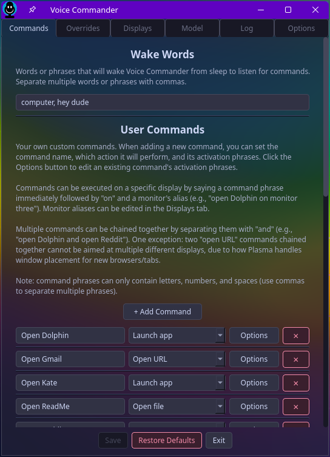

# Voice Commander


-success.svg)

A voice control app for KDE Plasma 6 on Wayland. Say a wake word, then a
command, and it does the thing. Speech recognition happens entirely on your
machine, so there's no account to create and nothing gets sent anywhere.

<p align="center">
  
</p>

---

## Table of Contents

- [What is Voice Commander?](#what-is-voice-commander)
- [Features](#features)
- [Requirements](#requirements)
- [Installation](#installation)
- [Quick Start](#quick-start)
- [How It Works](#how-it-works)
- [The Settings Window](#the-settings-window)
  - [Commands](#commands)
  - [Overrides](#overrides)
  - [Displays](#displays)
  - [Model](#model)
  - [Log](#log)
  - [Options](#options)
- [Confirming Destructive Commands](#confirming-destructive-commands)
- [Open Mic Mode](#open-mic-mode)
- [Optional Hardware: ReSpeaker LED Ring](#optional-hardware-respeaker-led-ring)
- [Updating](#updating)
- [Uninstalling](#uninstalling)
- [Troubleshooting](#troubleshooting)
- [Known Limitations](#known-limitations)
- [For Developers](#for-developers)
- [License](#license)

---

## What is Voice Commander?

Voice Commander is a voice-controlled application for KDE Plasma 6. It runs
quietly in your system tray and waits for a wake word. Once it hears one, it
listens for a few seconds for a command (open an app, change the volume,
move a window to another monitor, that kind of thing) and then does it.

Speech recognition happens entirely on your computer using an open-source
recognition engine called Vosk. Nothing you say is sent anywhere. The only
time Voice Commander needs the internet at all is during installation, to
download the recognition model. After that it works completely offline
(commands that open a website obviously still need a connection to reach
that website).

Everything is configurable from the settings window, but if you'd rather
hand-edit the config, it's stored as plain JSON. No fighting a GUI required
if you don't want to.

## Features

- Speech recognition runs locally. No cloud service, no account, no
  telemetry.
- Set your own wake word, or several.
- The matcher tolerates small mishearings on its own, and you can add fixes
  for whatever words it keeps getting wrong with your voice or mic.
- Chain commands together in one sentence: "open reddit and open youtube"
  fires both. If part of it gets misheard, the rest still goes through.
- Works across multiple monitors. Name your displays once, then send any
  command to a specific one, or move whatever window is currently focused.
- Shutdown, restart, and logout always ask you to confirm out loud before
  they run.
- Open Mic mode drops the wake-word requirement for as long as it's
  active, for stretches where you're using commands often and don't want
  the extra step every time.
- Launch apps, open websites or files, or run your own shell commands, all
  configurable from the settings window. No JSON editing required, though
  you can if you'd rather.
- The tray icon changes color depending on what it's doing, and if you've
  got a ReSpeaker mic array, its LED ring follows along too.
- Config changes take effect right away. No restart needed.
- The default speech model is small and barely touches your CPU or memory.

## Requirements

| | |
|---|---|
| **Desktop** | KDE Plasma 6, on Wayland |
| **Python** | 3.11 or newer |
| **Distro** | Works best on Arch-based (CachyOS, Manjaro, etc.) and Debian-based (Debian, Ubuntu, Kubuntu) systems, where the installer can detect the platform and tell you exactly what to install if something's missing. Other distros work fine too, you'll just be installing prerequisites yourself. |
| **Microphone** | Anything your system can see as a default audio input |

The installer also checks for a handful of command-line tools it depends on
(`pactl`, `pw-record`, `playerctl`, `kscreen-doctor`, `notify-send`,
`kwriteconfig6`, `dbus-send`, `xdg-open`, `curl`, `unzip`, `systemctl`) and
tells you what's missing if any of them aren't already on your system.
Everything else (the Python side of things) gets installed automatically
into its own self-contained environment, so it won't touch anything else on
your machine.

## Installation

```bash
git clone https://github.com/Trixles/Voice-Commander.git
cd Voice-Commander
./install.sh
```

No root access needed. The installer:

1. Checks you have everything it needs and tells you exactly what to grab
   if you don't.
2. Copies the app into `~/.local/share/voice-commander/`, along with its
   own isolated Python environment.
3. Downloads the small speech-recognition model (about 40 MB) if it isn't
   already there.
4. Installs a small helper script that lets Plasma move windows between
   monitors on command.
5. Writes a starter configuration file, unless you already have one.
   Re-running the installer never overwrites your settings.
6. Sets up and starts the background service, an entry in your application
   menu, and a `voice-commander` command for the terminal.

Re-running `./install.sh` any time, to update for instance, is always safe.
Your configuration is never touched.

Launch on login is off by default. Turn it on from Settings → Options if
you want it starting automatically with your session.

Got a ReSpeaker XVF3800 mic array? The installer notices and turns on LED
support for it automatically. If a permission rule it needs isn't installed
yet, it'll print a one-line `sudo` command to add it. See
[Optional Hardware](#optional-hardware-respeaker-led-ring) for the details.

## Quick Start

After installing, look for the icon in your system tray. Right-click it for
Settings, the Log, or to quit. Left-click toggles
[Open Mic mode](#open-mic-mode).

The default wake words are "computer" and "hey dude." Try saying:

```
"Computer, open browser."
"Computer, open reddit."
"Computer, volume up."
"Computer, open browser on monitor two."
"Computer, shut down."
  → "Shutdown command received. Say 'confirm', 'yes', or 'do it' to proceed."
"Confirm."
```

A few example commands come pre-set so there's something to try right
away: Open Browser, Open Reddit (the old design, don't @ me), and Open
ReadMe, which opens this file. They're ordinary commands like any other, so
rename them, repoint them, or delete them from the Commands tab whenever
you want.

## How It Works

Voice Commander spends most of its time doing nothing. It's listening only
for a wake word, and otherwise ignores whatever you say.

The moment it catches one (even partway through a sentence, so you don't
have to pause first) it wakes up and opens a short listening window, five
seconds by default. Keep talking and the window keeps resetting, so a
longer command or a chain of them doesn't get cut off early.

Whatever it hears next goes through two passes. First, any fixes you've set
up under Overrides get applied. These catch specific words your mic or
voice trips Vosk up on, before matching even starts. Then it's compared
against every command phrase you've configured, using a fuzzy match that
forgives small mistakes but won't fire on something unrelated just because
it shares a word with a real command.

A match runs and you get a quick notification confirming what happened. No
match gets a "No match" notification, and Voice Commander goes straight
back to sleep. It doesn't sit there waiting for a second attempt.

You can also chain commands in one breath, like "open reddit and open
youtube," and both will fire. If part of a chain doesn't get recognized,
the rest still goes through, and you're told which part didn't.

Everything it hears, matches, or runs gets logged on the Log tab, so you
can always see exactly what it picked up, which, this being Vosk, is
sometimes funnier than you'd expect.

## The Settings Window

Right-click the tray icon and choose Settings, or just say "open voice
commander settings." Everything here is adjustable through the interface,
though if you'd rather edit the config by hand, it lives at
`~/.config/voice-commander/commands.json` as plain JSON.

| Tab | What it's for |
|---|---|
| [Commands](#commands) | Wake words, and every command, yours and the built-in ones. |
| [Overrides](#overrides) | Fixes for words that keep getting misheard. |
| [Displays](#displays) | Name your monitors so you can talk to them individually. |
| [Model](#model) | Pick which speech-recognition model to use. |
| [Log](#log) | A live look at everything Voice Commander hears. |
| [Options](#options) | Login behavior, notifications, and how strict matching should be. |

### Commands

This is the core of the app, split into two parts.

**User Commands** are yours to add, edit, or delete. Click Add Command, give
it a name, pick what it should do, and set the phrase (or phrases) that
trigger it. Four types are available:

| Action | What it does |
|---|---|
| Launch App | Opens an installed application, picked from a searchable list. |
| Open URL | Opens a web address, optionally in a specific browser. |
| Open File | Opens a file, script, or app shortcut (basically anything your file manager could open directly). |
| Run Command | Runs a shell command of your choosing. The catch-all for anything the other three don't cover. |

Any command can be aimed at a specific monitor by adding "on {alias}" to
the end of the phrase, like "open dolphin on monitor 3." Monitor names are
set on the [Displays](#displays) tab.

**System Commands** are the built-ins: mic toggling, window management,
volume, media playback, power. You can't rename them or change what they
do, but every phrase is editable, and each one can be switched off
individually:

| Category | Commands |
|---|---|
| Mic | Open mic, close mic |
| Window | Move left, move right, minimize, maximize, close, move to *{alias}* |
| Volume | Volume up, volume down, mute, unmute, set volume to *{level}* |
| Media | Pause, resume |
| Power | Shut down, restart, log out *(all three [ask for confirmation](#confirming-destructive-commands) first)* |
| Settings | Open Voice Commander settings |

Switching a command off doesn't just go silent on you. Saying its phrase
still gets a notification telling you it's disabled, so you know why
nothing happened instead of wondering if you mumbled.

### Overrides

Vosk does a good job, but it's not psychic, and certain words get misheard
the same way every time for a given voice and mic. Overrides fix that for
good: a simple "it heard X, I meant Y" rule that's applied before anything
gets matched.

A handful ship by default, covering common mishearings, things like
correcting "cause" to "close," or "mike" to "mic." You can switch any of
them off, but not edit or delete them.

Add your own under User Overrides: a word or phrase Vosk tends to mishear,
and what you actually meant. Matching only happens on whole words, so a
rule for "in" won't quietly break "open" or "spin." If something keeps
getting misheard, check the [Log tab](#log) to see exactly what was
transcribed, then add a rule for it.

### Displays

Connected monitors show up automatically. Click Aliases on one to give it a
name. Defaults like "monitor one" and "monitor two" are filled in to start.

Once a monitor has a name, you can:

- Send any command to it, by adding "on {alias}" to the phrase, like
  "open dolphin on monitor three."
- Move whatever window is currently active onto it, by saying
  "move to {alias}."

The other window controls (move left, move right, minimize, maximize,
close) live under [System Commands](#commands) rather than here.

### Model

Speech recognition is handled by Vosk. The small model installed by
default is the recommended choice. It won't win any accuracy contests, but
it's good enough for most commands and barely uses any memory or CPU. If
you want better accuracy and don't mind the extra resource use, grab a
[larger model](https://alphacephei.com/vosk/models) and point this tab at
it. Switching models needs a restart, which the settings window will remind
you about when you save.

### Log

Tracks wake word and command activation, and shows exactly what is heard
by the interpreter (which is sometimes unintentionally hilarious). If a
certain word or phrase is being consistently misheard, you can create an
[override](#overrides) for it.

### Options

Three settings, plus a short About blurb.

**Launch on login** is off unless you turn it on. Voice Commander won't
start automatically with your session otherwise.

**Enable notifications** is a blanket switch for desktop notifications. It
doesn't touch the confirmation prompts for shutdown, restart, or logout,
though. Those always show up regardless, so there's no setting that lets
you confirm something destructive without seeing it first.

**Recognition strictness** controls how closely what you say has to match
a command phrase before it fires. The default is a sane middle ground; the
slider goes all the way to either extreme if you really want, with a clear
warning attached: too loose and things misfire, too strict and real
commands stop registering.

## Confirming Destructive Commands

Shutdown, restart, and logout all need a spoken yes before they happen.
Trigger one and you'll get a notification with a five-second window to
respond:

- Say "confirm," "yes," or "do it" to go ahead.
- Say "cancel," "never mind," or "abort" to back out.
- Say nothing, and it cancels itself once the window runs out.

This prompt always shows up, even with notifications turned off in
[Options](#options). There's no way to end up confirming something
destructive without seeing it.

## Open Mic Mode

Normally you say a wake word before every command. Open Mic mode turns
that requirement off entirely, as long as it's active. Useful if you
know you'll be using commands steadily for the next while and don't want
to say "computer" before each one.

This is separate from [chaining commands](#how-it-works), which is what
lets you say several things in one breath ("open reddit and open
youtube"). Chaining is about a single sentence; Open Mic mode is about
cutting the wake-word friction over a longer stretch of time.

Toggle it by left-clicking the tray icon, or by saying "open mic" / "close
mic" (phrases editable under [System Commands](#commands)). The tray icon
and a notification both make it obvious when it's on, so you won't forget
it's active and wonder why a stray sentence just launched something.

## Optional Hardware: ReSpeaker LED Ring

If you have a Seeed Studio ReSpeaker XVF3800 mic array, Voice Commander
will drive its LED ring to match whatever the tray icon is showing:
sleeping, listening, open mic, and error each get their own color. This is
entirely optional, detected automatically, and does nothing if you don't
have the hardware.

Controlling the LEDs needs a small permission rule added to your system,
which the installer can't add on its own (that would require `sudo`, and
the installer deliberately avoids asking for it). If the rule isn't there
yet, `install.sh` prints the exact command to add it. Run it whenever you
like. Everything else works fine without it, and the LEDs pick up as soon
as the rule's in place and you unplug and replug the device.

## Updating

```bash
cd Voice-Commander
git pull
./install.sh
```

Re-running the installer updates the app and restarts the service. Your
`commands.json` is never touched.

## Uninstalling

```bash
./uninstall.sh
```

Removes the background service, launcher, application-menu entry, and
everything else the installer put in place. Your `commands.json` is kept
by default. To remove that too:

```bash
./uninstall.sh --purge
```

## Troubleshooting

**No tray icon, or the service won't start**
```bash
systemctl --user status voice-commander
journalctl --user -u voice-commander -f
```

**Wake word isn't triggering, or commands keep misfiring.** Open the
[Log tab](#log) and watch what's actually being transcribed while you
talk. If one particular word is consistently wrong, add an
[override](#overrides) for it. If recognition feels too loose or too
strict overall, adjust Recognition Strictness in [Options](#options).

**Commands go to the wrong monitor, or don't move at all.** Make sure the
monitor has a name set on the [Displays](#displays) tab, and that you're
running KDE Plasma 6. Multi-monitor support depends on a Plasma-specific
helper script that only installs there.

**`voice-commander` command not found in a terminal.** `~/.local/bin`
isn't on your `PATH`. Add it in your shell's config file (`~/.bashrc`,
`~/.zshrc`, etc.).

**ReSpeaker LED isn't changing.** See
[Optional Hardware](#optional-hardware-respeaker-led-ring); you likely
need to add the permission rule.

## Known Limitations

- **Chaining two URL commands aimed at different monitors gets rejected**,
  rather than risk doing the wrong thing. A browser might reuse its
  existing window, open a new one, or open new tabs depending on what
  state it's in when the command runs, and there's no reliable way to
  predict which, so that specific case is refused outright. Opening
  multiple URLs aimed at the same monitor (or with no monitor specified at
  all) works fine.
- **Command phrases can't start with the word "the."** It gets silently
  stripped before matching, because some mics with built-in noise
  processing (the ReSpeaker XVF3800 included) occasionally imagine it
  was said when it wasn't.

## For Developers

This README covers using Voice Commander day to day. If you're digging
into the code itself:

- **`ARCHITECTURE.md`** documents the non-obvious design decisions: the
  reasoning behind the matching pipeline, the settings UI, and the
  window-placement integration with KWin.
- **`CHANGELOG.md`** has the full version history.

Contributions, issues, and forks are welcome under the license below.

## License

[MIT](LICENSE). Do what you want with it.
